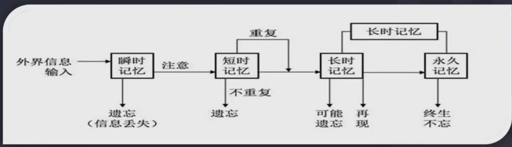

 
[视频地址 ](https://www.bilibili.com/video/BV1wA4y1S7DQ)

# 语言类的学习方法
1. 选择优秀的文章背诵，具有永久价值、不枯燥，历久弥新
2. 拆成单个句子，复杂的句子拆分成短句
3. 循环往复、循序渐进背诵、默写
4. 理解文章的含义
5. 背诵下一句前，把以往所学背诵一边，遇到卡顿错漏重复背诵
6. 直到这些文章成为自己身体的一部分，随意调遣使用

# 理工科的学习方法
1. 基本概念定义背熟
2. 能独立推到出来的一切可以推到的，独立推到熟练
3. 相关感悟、弄懂的题目装进进步本
4. 反复重做、标注，达到不忘，熟练
5. 回环往复循序渐进，用前面的知识理解后面的，反之亦然，融汇贯通

# 康奈尔笔记法

## 笔记的组成有如下

### 主栏（记录）- Record
读书听课记录尽可能丰富的信息

### 副栏（简化）-Reduce
简单的抽象 归纳 概括
通过副栏信息对主栏内容背诵，复习主栏复现所学

### 思考-Reflect
想法 感悟 体会 未解决的问题 的记录

## 笔记的使用方法

### 背诵-Recite
把主栏遮住，只用副栏复现所学

### 复习-Review
每周花十分钟左右时间，快速复习笔记

# 第六节-打造极致心态：成为满分考生

“百分之九十九等于零”讲的是人生质地。万丈高楼平地起，凭啥？凭的是每个环节的扎扎实实。否则蓝图绘制的再好，都会一再倒塌，最终只能停留在幻想

# 第七节-细分阶段目标：让成就感加速学习步伐

要学会制定目标  
- S-specific
- M-measurable
- A-amazing
- R-realistic
- T-time bound

让目标粉末化 感受突破成功的感觉 就能快速进步

# 第八节-构建学习方案：增幅学习效果，指数增长

案例：巴菲特财富的指数增长，十岁的目标三十岁达到一百万，奇特的地方是五十岁以后拿到他99%的财富
巴菲特反复强调：
1. Rule number one:never lose money
2. Rule number two:never forget rule number one

学习是一样的道理：不要丢掉知识，不要遗忘知识

案例：上学的时候看到同桌在刷题，同桌又做了30页笔记 又做了50页的笔记 又刷了50套题10套题 就着急追赶

这时候经常会忘记法则一，最终的结果就是忙活一天，实际没有进步，新学的东西，减去已经遗忘的东西，实际上没有进步 原地踏步 甚至还退步了 那学来学去的话就是内心不断的崩溃

高筑墙、广积粮、缓称王。- 朱元璋

结硬寨，打呆仗。-曾国藩

# 第九节 学习的终极算法：构建你的增长引擎

